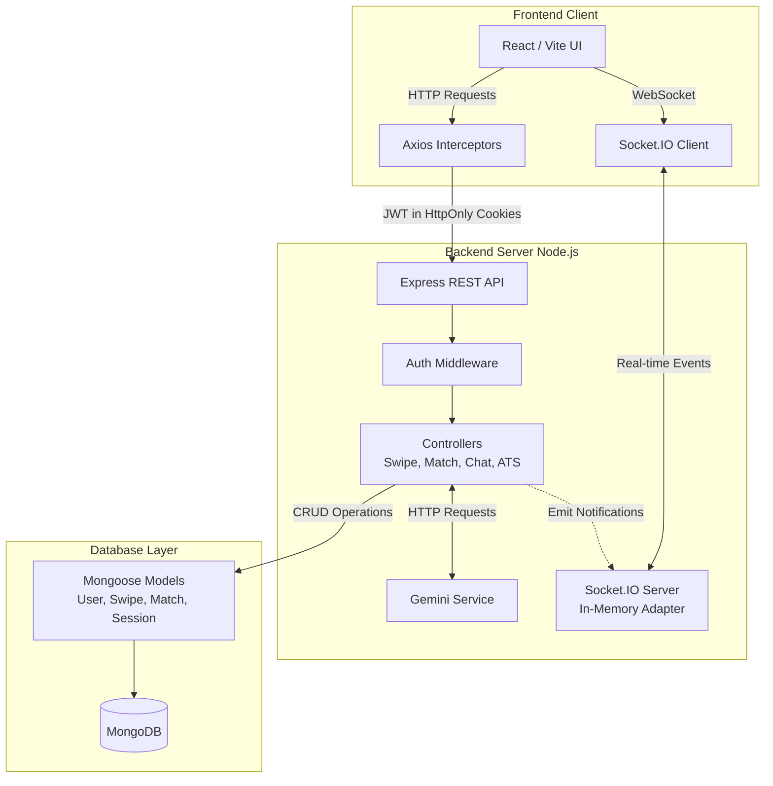
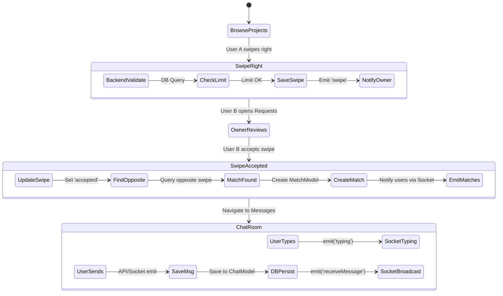
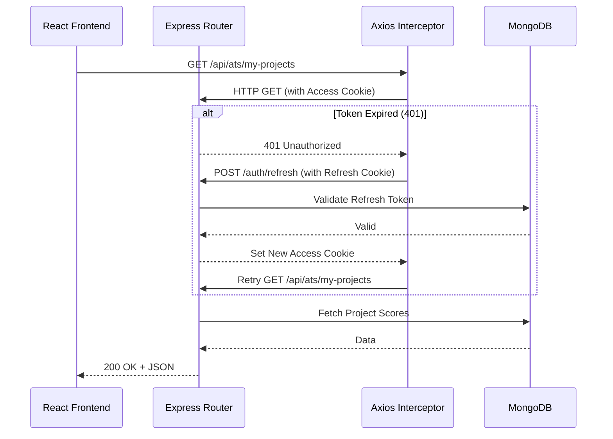
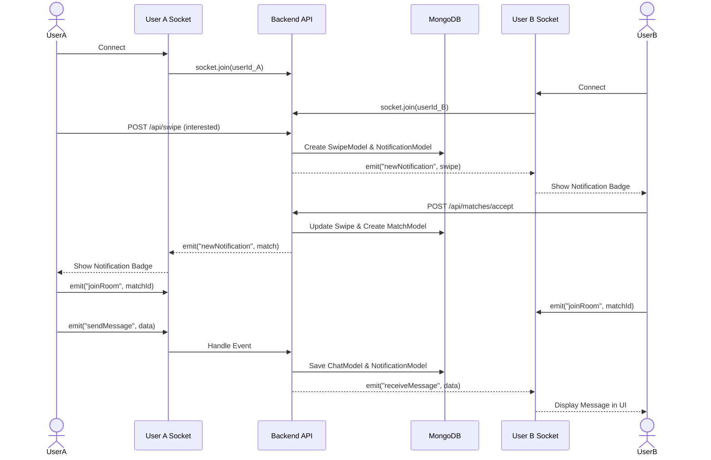

  <h1>🚀 DevSwipe System Architecture</h1>
  
<em>A deep-dive into the MERN stack architecture powering the DevSwipe platform.</em>

---

## 🏗️ 1. Architecture Summary

Based on a comprehensive analysis of the actual codebase, DevSwipe is a monolithic web application built on the **MERN stack** with real-time bidirectional communication.

### 💻 Actual Tech Stack
*   🎨 **Frontend**: React (Vite), Tailwind CSS, Framer Motion, Axios for HTTP.
*   ⚙️ **Backend**: Node.js, Express.js.
*   🗄️ **Database**: MongoDB with Mongoose ORM.
*   ⚡ **Real-time**: Socket.IO (In-memory adapter).
*   🔒 **Authentication**: Custom JWT-based stateless authentication.
*   🔌 **External APIs**: Gemini API (ATS project scoring), Cloudinary (image uploads).

## 🧩 2. Component Breakdown

### 🔐 A. Authentication (JWT-based)
*   **Implementation**: Stateless auth. The backend generates two JWTs (`accessToken` and `refreshToken`) stored securely as `HttpOnly` cookies.
*   **Flow**: Frontend `axios` interceptors catch `401 Unauthorized` responses and automatically hit `/auth/refresh`. Failed requests are queued, tokens are refreshed, and original requests are retried invisibly to the user.

### 💝 B. Swipe System (`swipeController.js`)
*   **Implementation**: Users swipe on projects (Left = `ignore`, Right = `interested`).
*   **Logic**: Before a swipe is recorded, the backend validates the user's daily limit (10 swipes/day) directly against the MongoDB `User` document. Right swipes create a `SwipeModel` document and emit a `"swipe"` notification.

### 🤝 C. Match Engine (`matchController.js`)
*   **Implementation**: Mutual acceptance based.
*   **Logic**: When a user accepts an incoming swipe, the backend sets that swipe status to `"accepted"`. It queries the DB for the *opposite* swipe. If both users accepted, a `MatchModel` document is created, and `"match"` notifications are emitted via socket.

### 💬 D. Real-time Chat & Collaboration (`socket.js`)
*   **Implementation**: Socket.IO for chat, notifications, and task management.
*   **Rooms**: 
    *   `joinUserRoom(userId)`: User-specific real-time notifications.
    *   `joinRoom(matchId)`: Isolated chat messages for match channels.
    *   `join-session(sessionId)`: Collaborative Kanban task boards.
*   **Chat Flow**: Messages save to MongoDB (`ChatModel`), populate with user data, and broadcast to the `matchId` socket room.

### 🔔 E. Notification System (`notificationController.js`)
*   **Implementation**: Persistent + Real-time.
*   **Logic**: The backend creates a `NotificationModel` document and attempts to emit it via `io.to(userId).emit("newNotification")`. If offline, the emit drops, but the notification remains unread in MongoDB to be fetched on the next load.

---

## 📈 3. Flow Diagrams

### 🌐 (A) High-level Architecture Diagram

### 🔄 (B) Swipe → Match → Chat Flow

### 📡 (C) API Authentication Flow

### 👥 (D) End-to-End User Interaction Flow

