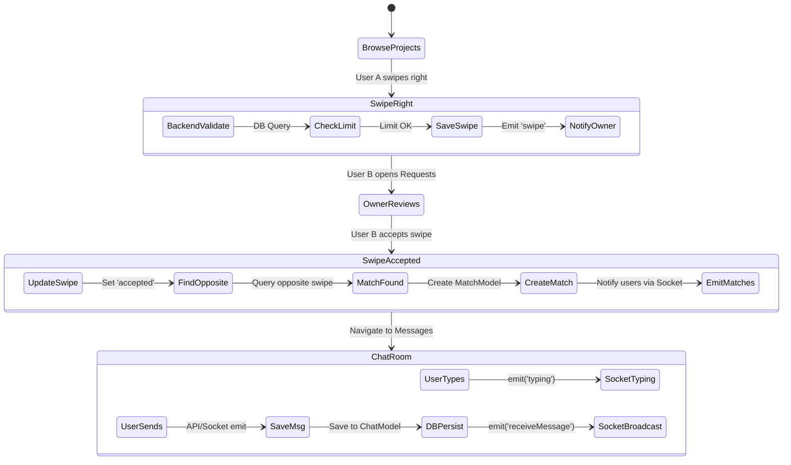
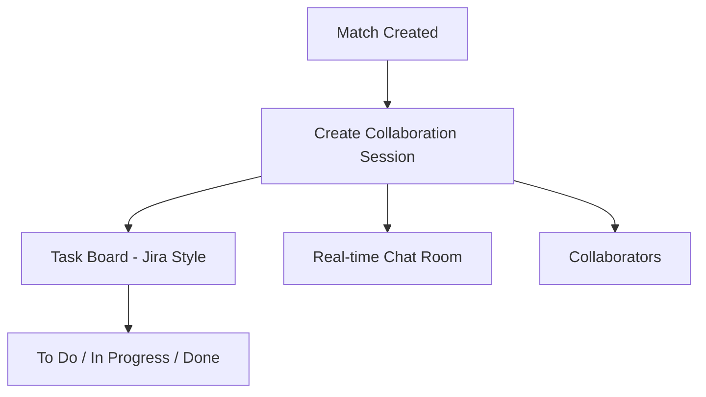

<div align="center">
  <h1>🚀 DevSwipe System Architecture</h1>
  <p><em>A deep-dive into the MERN stack architecture powering the DevSwipe platform.</em></p>
</div>

---

## 🌟 Product Philosophy

DevSwipe is not just a matching platform — it is a hybrid system inspired by:

🔥 Tinder-style discovery → for project collaboration
📊 Jira-style sessions → for managing collaborative workspaces after matching
💬 Real-time chat → for execution-level communication

This creates a full-cycle developer collaboration loop:

Discover → Match → Plan → Build → Track → Deliver

## 🏗️ 1. Architecture Summary

Based on a comprehensive analysis of the actual codebase, DevSwipe is a monolithic web application built on the **MERN stack** with real-time bidirectional communication.

### 💻 Actual Tech Stack
*   🎨 **Frontend**: React (Vite), Tailwind CSS, Framer Motion, Axios for HTTP.
*   ⚙️ **Backend**: Node.js, Express.js.
*   🗄️ **Database**: MongoDB with Mongoose ORM.
*   ⚡ **Real-time**: Socket.IO (In-memory adapter).
*   🔒 **Authentication**: Custom JWT-based stateless authentication.
*   🔌 **External APIs**: Gemini API (ATS project scoring), Cloudinary (image uploads).


## 🧩 2. Component Breakdown

### 🔐 A. Authentication (JWT-based)
*   **Implementation**: Stateless auth. The backend generates two JWTs (`accessToken` and `refreshToken`) stored securely as `HttpOnly` cookies.
*   **Flow**: Frontend `axios` interceptors catch `401 Unauthorized` responses and automatically hit `/auth/refresh`. Failed requests are queued, tokens are refreshed, and original requests are retried invisibly to the user.

### 💝 B. Swipe System (Tinder-style discovery engine)

DevSwipe uses a Tinder-like interaction model for project discovery:

- 👉 Swipe Right = Interested in collaborating on a project
- 👈 Swipe Left = Not interested

Unlike traditional job boards, DevSwipe focuses on **mutual intent-based collaboration**, not passive applications.

Once both users show interest, the system triggers a match event in real-time.

### 🤝 C. Match Engine (`matchController.js`)
*   **Implementation**: Mutual acceptance based.
*   **Logic**: When a user accepts an incoming swipe, the backend sets that swipe status to `"accepted"`. It queries the DB for the *opposite* swipe. If both users accepted, a `MatchModel` document is created, and `"match"` notifications are emitted via socket.

### 💬 D. Real-time Chat & Collaboration (`socket.js`)
*   **Implementation**: Socket.IO for chat, notifications, and task management.
*   **Rooms**: 
    *   `joinUserRoom(userId)`: User-specific real-time notifications.
    *   `joinRoom(matchId)`: Isolated chat messages for match channels.
    *   `join-session(sessionId)`: Collaborative Kanban task boards.
*   **Chat Flow**: Messages save to MongoDB (`ChatModel`), populate with user data, and broadcast to the `matchId` socket room.

### 🔔 E. Notification System (`notificationController.js`)
*   **Implementation**: Persistent + Real-time.
*   **Logic**: The backend creates a `NotificationModel` document and attempts to emit it via `io.to(userId).emit("newNotification")`. If offline, the emit drops, but the notification remains unread in MongoDB to be fetched on the next load.

### 📊 F. Collaboration Sessions (Jira-inspired system)

After a successful match, DevSwipe creates a "Session Workspace" — a structured collaboration environment similar to Jira.

Each session includes:

- 🧩 Task Board (To Do → In Progress → Done)
- 👥 Assigned collaborators (matched users)
- 💬 Dedicated real-time chat room
- 📂 Shared project context
- 🧠 Optional AI-assisted task suggestions (future scope)

#### 🧠 Purpose:
While Tinder handles "discovery", Jira handles "execution".

DevSwipe bridges both:
👉 Match = Intent  
👉 Session = Execution  
---

## 📈 3. Flow Diagrams

### 🌐 (A) High-level Architecture Diagram

```mermaid
graph TD

    subgraph Frontend Client
        React[React / Vite UI]
        Axios[Axios Interceptors]
        SocketClient[Socket.IO Client]
    end

    subgraph Backend Server Node.js
        Express[Express REST API]
        Auth[Auth Middleware]
        SocketServer[Socket.IO Server\nIn-Memory Adapter]

        Controllers[Controllers\nSwipe, Match, Chat, ATS]
        Gemini[Gemini Service]
    end

    subgraph Database Layer
        MongoDB[(MongoDB)]
        Models[Mongoose Models\nUser, Swipe, Match, Session, Chat]
    end

    %% Core flows
    React -->|HTTP Requests| Axios
    Axios -->|JWT Cookies| Express
    Express --> Auth
    Auth --> Controllers
    Controllers --> Models
    Models --> MongoDB

    Controllers <-->|External API| Gemini

    React -->|WebSocket| SocketClient
    SocketClient <-->|Real-time Events| SocketServer
    Controllers -.->|Emit Notifications| SocketServer

    %% 🔥 NEW: Tinder + Jira hybrid layer
    Controllers --> Match[Match Engine]
    Match --> Session[Collaboration Session Created]

    Session --> JiraBoard[Jira-style Task Board\n(To Do / In Progress / Done)]
    Session --> ChatRoom[Real-time Chat Room]
    Session --> Members[Collaborators Workspace]

    JiraBoard --> Tasks[Task Management System]
```

### 🔄 (B) Swipe → Match → Chat Flow



### 📡 (C) MATCH FLOW

