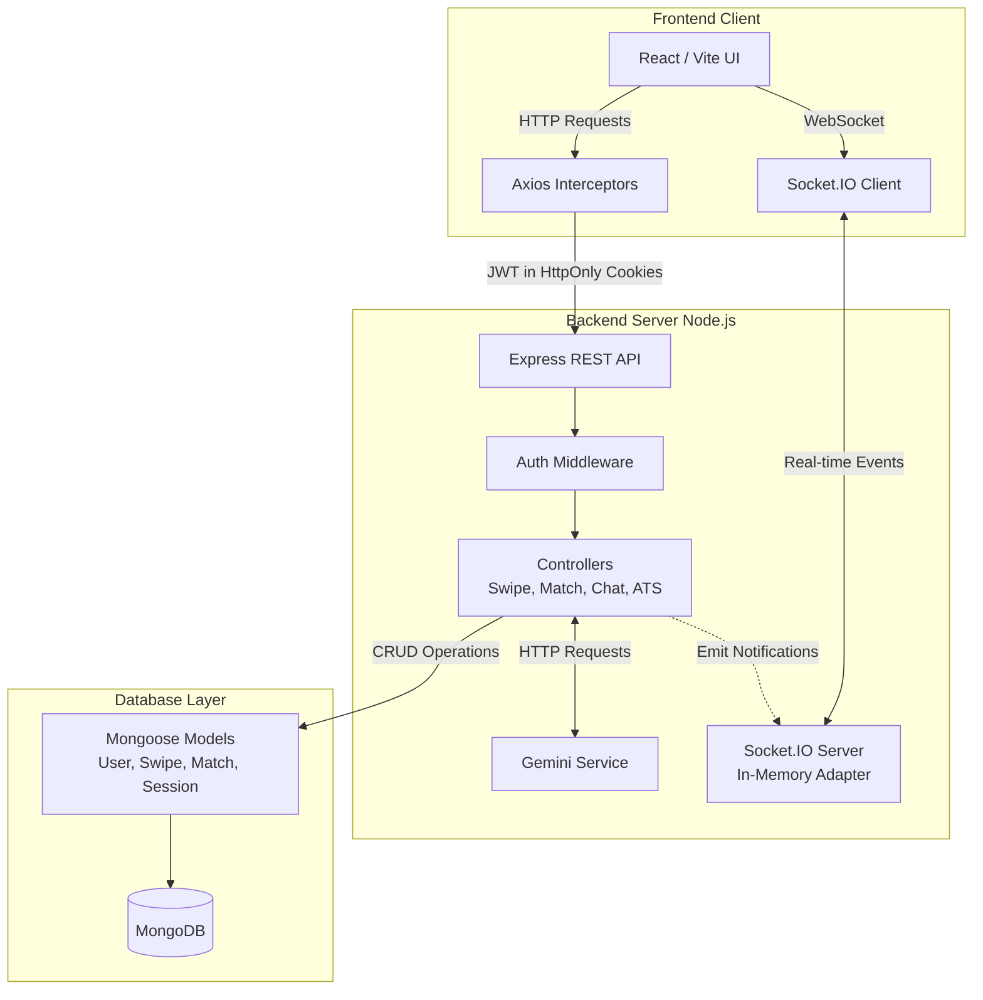

# DevSwipe System Architecture

## 1. Architecture Summary

Based on a comprehensive analysis of the actual codebase, DevSwipe is a monolithic web application built on the MERN stack (MongoDB, Express, React, Node.js) with real-time bidirectional communication via Socket.IO.

**Actual Tech Stack:**
*   **Frontend**: React (Vite), Tailwind CSS, Framer Motion, Axios for HTTP.
*   **Backend**: Node.js, Express.js.
*   **Database**: MongoDB with Mongoose ORM.
*   **Real-time Communication**: Socket.IO (In-memory adapter).
*   **Authentication**: Custom JWT-based stateless authentication.
*   **External APIs**: Gemini API (for ATS project scoring), Cloudinary (for image uploads).

## 2. Component Breakdown

### A. Authentication (JWT-based)
*   **Implementation**: Stateless auth. The backend generates two JWTs (`accessToken` and `refreshToken`) and sets them as `HttpOnly` cookies.
*   **Flow**: Frontend `axios` interceptors catch `401 Unauthorized` responses and automatically hit the `/auth/refresh` endpoint. Failed requests are queued, the token is refreshed, and original requests are retried invisibly to the user.

### B. Swipe System (`swipeController.js`)
*   **Implementation**: Users swipe on projects (Left = `ignore`, Right = `interested`).
*   **Logic**: Before a swipe is recorded, the backend validates the user's daily limit (10 swipes/day) directly against the MongoDB `User` document. When a user swipes right, a `SwipeModel` document is created, and an `"swipe"` notification is generated for the project owner.

### C. Match Engine (`matchController.js`)
*   **Implementation**: Mutual acceptance based.
*   **Logic**: When a user goes to their "Requests" page and accepts an incoming swipe, the backend sets that swipe status to `"accepted"`. It then queries the DB for the *opposite* swipe. If both users have accepted each other's projects, a `MatchModel` document is created, and `"match"` notifications are emitted via socket.

### D. Real-time Chat & Collaboration (`socket.js`)
*   **Implementation**: Socket.IO for chat, notifications, and task management.
*   **Rooms**: 
    *   `joinUserRoom(userId)`: Used for user-specific real-time notifications.
    *   `joinRoom(matchId)`: Used for isolating chat messages to specific match channels.
    *   `join-session(sessionId)`: Used for collaborative Kanban task boards.
*   **Chat Flow**: Messages are first saved to MongoDB (`ChatModel`), populated with user data, and then broadcasted to the `matchId` socket room.

### E. Notification System (`notificationController.js`)
*   **Implementation**: Persistent + Real-time.
*   **Logic**: The backend creates a `NotificationModel` document and attempts to emit it via `io.to(userId.toString()).emit("newNotification")`. If the user is offline, the socket emit silently drops, but the notification remains unread in MongoDB and is fetched via REST API on the next app load.

---

## 3. Flow Diagrams

### (A) High-level Architecture Diagram



### (B) Swipe → Match → Chat Flow

```mermaid
stateDiagram-v2
    [*] --> BrowseProjects
    
    BrowseProjects --> SwipeRight : User A swipes right
    
    state SwipeRight {
        direction Backend Validate
        BackendValidate --> CheckLimit: DB Query (User.dailySwipeCount)
        CheckLimit --> SaveSwipe: Limit OK, Create SwipeModel (status: interested)
        SaveSwipe --> NotifyOwner: Emit 'swipe' notification
    }
    
    SwipeRight --> OwnerReviews : User B opens Requests
    OwnerReviews --> SwipeAccepted : User B accepts swipe
    
    state SwipeAccepted {
        direction Backend Match Logic
        UpdateSwipe --> FindOpposite: Set User B's swipe to 'accepted'
        FindOpposite --> MatchFound: Query DB for User A's 'accepted' swipe
        MatchFound --> CreateMatch: Create MatchModel document
        CreateMatch --> EmitMatches: Notify both users via Socket
    }
    
    SwipeAccepted --> ChatRoom : Users navigate to Messages
    
    state ChatRoom {
        direction Real-Time Loop
        UserTypes --> SocketTyping: emit('typing')
        UserSends --> SaveMsg: API Call / Socket emit('sendMessage')
        SaveMsg --> DBPersist: Save to ChatModel
        DBPersist --> SocketBroadcast: io.to(matchId).emit('receiveMessage')
    }
```
